# Crackme #1

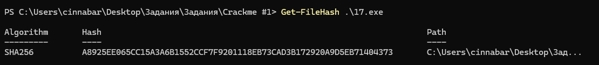
Результат выполнения команды Get-FileHash .\17.exe в PowerShell

## Вопросы

1. Какой корневой раздел программа пытается открыть?\
Программа открывает раздел `HKEY_CURRENT_USER`

2. Какой подключ программа пытается открыть?\
Программа ищет путь `Software\uLCnSBOdTo`

3. Какой параметр подключа программа пытается открыть?\
Параметр `3ClgZ`

4. Что произойдет, если программа не найдет такой подключ?

    Функция `RegQueryValueExA` вернёт ошибку и выполнится переход к подпрограмме `sub_4017BB`, выполняющей `ExitProcess(0)`
    
    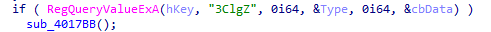
    
    А для пользователя на мгновение откроется консоль и сразу же закроется

5. Какое значение должен хранить параметр подключа, чтобы программа вывела FLAG?\
Параметр должен содержать строку: `cknloKtidY12eClAi0ZkyfPkSwUTPvH3sNLELaWm`

6. Зачем дважды подряд вызывается WinAPI функция RegQueryValueExA?

   Первый вызов делается с целью узнать размер данных (длину флага), которые лежат в реестре.
   Затем программа выделяет в памяти буфер нужного размера (в два раза больше длины строки), чтобы данные точно поместились.
   Вторым вызовом программа копирует в буфер значение флага из реестра.

\
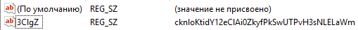

## Описание логики программы

### sub_4015E9 и sub_401550

`sub_4015E9` проходит циклом по двум массивам данных (`unk_405060` и `unk_4050E0`) в секции .rdata. 

Чтобы запутать порядок, она использует массив индексов `dword_405020`. Программа берет оттуда номер и умножает его на 10, чтобы прыгнуть к нужному куску данных.

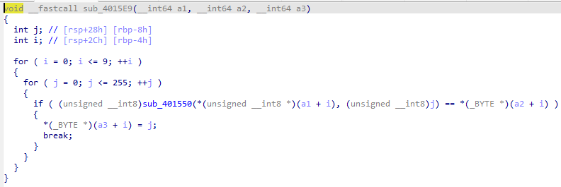

Для каждой пары байтов она вызывает `sub_401550`, которая выполняет операцию XOR.

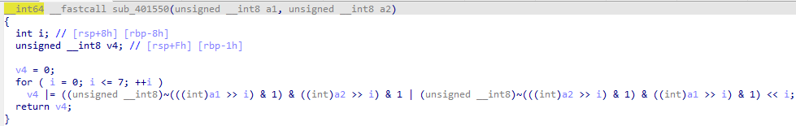

### sub_401706

Внутри неё реализован цикл на 12 повторений. На каждой итерации она берет новый сгенерированный ключ и вызывает функцию шифрования `sub_401679`.

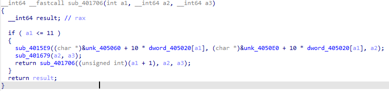

### sub_401679

Функция берет строку (строка из реестра в формате Base64) и 10-байтный ключ из `sub_4015E9`. Поскольку строка длиннее ключа, программа использует оператор % 10. Это позволяет ключу «бежать» по кругу: 1-й байт ключа XOR'рит 1-й байт строки, 11-й байт строки и так далее.

### sub_4017D2

Она преобразует результат всех XOR-манипуляций из набора байтов в читаемую строку по стандарту Base64.

Внутри функции зашит алфавит ABCDEFGHIJKLMNOPQRSTUVWXYZabcdefghijklmnopqrstuvwxyz0123456789+/. Если после всех раундов XOR данные не превращаются в валидный Base64, программа понимает, что ключ в реестре неверный.

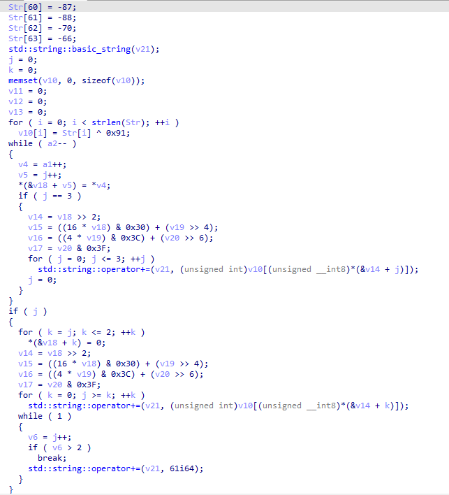

Сначала программа восстанавливает алфавит Base64, выполняя `XOR 0x91` над скрытым массивом байтов.

Далее данные обрабатываются порциями: 3 байта входных данных преобразуются в 4 символа из восстановленного алфавита с помощью битовых сдвигов (`>>`, `<<`).

## Получение флага

Скрипт просто разворачивает то, что делает программа, в обратную сторону.
Он берёт массив `byte_404020`, который представляет собой зашифрованный флаг, и снимает с него все 12 слоёв XOR в обратном порядке. Ключи для каждого прохода восстанавливаются так же, как это делает сама программа: берутся два массива из секции данных и делается над ними XOR попарно. После снятия всех слоёв фильтруются лишние байты, и остаётся строка в формате Base64, которая затем декодируется в флаг, который нужно вписать в реестр.

**[Скрипт для расшифровки](./crackme1.py)**

# Crackme #2

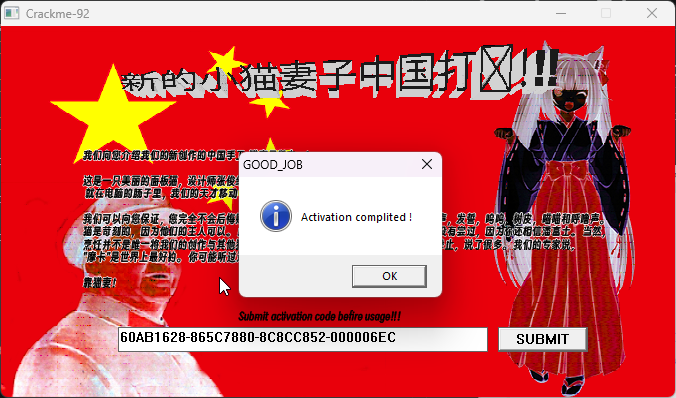

## Описание логики программы

Логика программы с шифровкой флага располагается в функции `sub_4017BD`

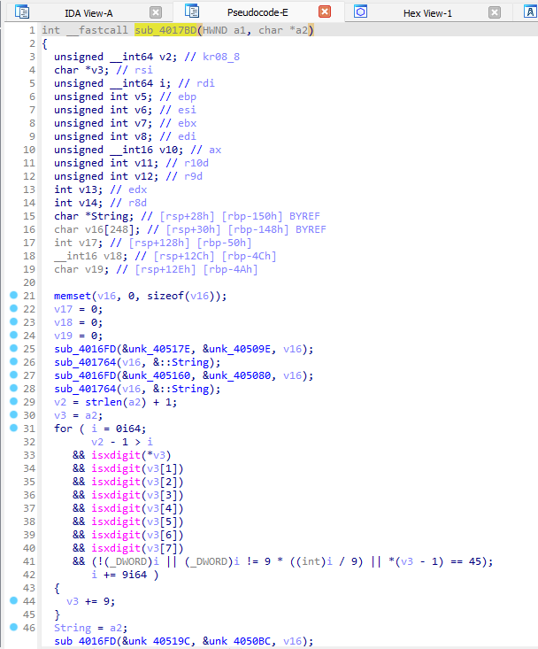

### sub_4016FD и sub_4016AD

Функция `sub_4016AD` выполняет XOR «вручную» с помощью цикла на 8 итераций, битовых сдвигов (>>) и логического И (& 1), обрабатывая каждый бит отдельно

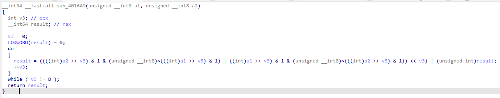

Функция `sub_4016FD` просто берет 30 байт из массива `unk_40517E`, делает тот «ручной» XOR с 30 байтами из массива `unk_40509E` и сохраняет чистый результат в массив `v16`

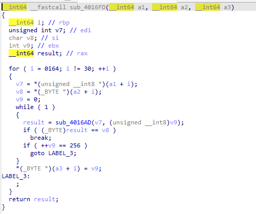

### sub_401764

Эта функция используется для форматирования текстового вывода. Она принимает строку из `v16` и в цикле из 5 итераций накладывает её на глобальный буфер String по формуле `String[i] ^= v16[i % 30]`. Для этого она снова вызывает подпрограмму `sub_4016AD`

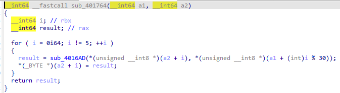

Далее с помощью цикла и стандартных проверок isxdigit программа контролирует структуру строки. Введенный ключ должен строго соответствовать структуре XXXXXXXX-XXXXXXXX-XXXXXXXX-XXXXXXXX

Если проверка пройдена успешно, текстовые блоки переводятся в четыре 32-битных числа (`v5`, `v6`, `v7`, `v8`) с помощью функции `strtoul(..., 16)`

Если четвертый блок `v8` инициализирован, запускается циклический блочный шифр. Значение `v8` (0x6EC или же 1772) определяет точное количество раундов в цикле do-while.

На каждом раунде значения `v5`, `v6` и `v7` преобразуются через операции сложения, вычитания, битовых сдвигов и XOR с фиксированными константами

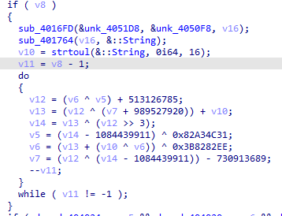

После завершения 1772 раундов итоговое состояние переменных сравнивается с эталонными константам из секции `.data` (`dword_404018 — dword_404024`). Если все значения совпадают, вызывается `MessageBoxA` с успешной активацией.

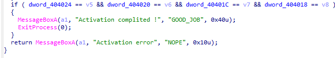

## Получение флага

По сути своей всё, что располагается до проверки `if ( v8 )` не имеет никакого смысла для получения флага.

Мы можем взять эталонные константы `dword_404018 - dword_404024` и провернуть обратные операции.

`v5 = 0xD6035192`\
`v6 = 0xA5BA2D3B`\
`v7 = 0x0A409BAB`\
`v8 = 0x000006EC`

Скрипт эмулирует работу шифра в обратном направлении. Он запускает цикл на 1772 итерации (0x000006EC), где на каждом шаге инвертирует математические операции исходного алгоритма (заменяя сложение на вычитание, а вычитание на сложение, XOR самообратима) с применением маски & 0xFFFFFFFF для симуляции переполнения 32-битных регистров 

Скрипт восстанавливает исходные значения блоков, переводит их в Hex-строку и формирует флаг.

FLAG: `60AB1628-865C7880-8C8CC852-000006EC`

**[Скрипт для расшифровки](./crackme2.py)**